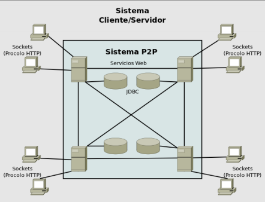

# HybridServer


Hybrid client/P2P/server system for the management of HTML and XML (including support for XSD and XSL Transformations) documents.



Clients connect to any of the servers through HTTP. The server will retrieve all of the documents stored in its database and in the databases of its peers through P2P, making it a decentralized database of structured documents.

## Installation

1. Add the libraries specified in ```.classpath```.

2. Configure the database

    1. Import the script ```db.sql``` to define the database schema

    2. Configure database URL, username and password in ```configuration.xml```

3. Configure the application in ```configuration.xml```

4. Specify peers' in ```configuration.xml```

5. Launch the application 


## Usage

Interaction with the system is done through a RESTful API that **does NOT require client authentication**.

### /

#### ```* /``` (Any method)

Retrieves an HTML document that contains links to /html, /xml /xsd, and /xslt

### /html

#### GET /html

Retrieves a list of all the HTML documents stored in the P2P network

##### GET /html?uuid=UUID

Retrieves the HTML document whose uuid is UUID 

### POST /html

Parameters:

    - html: The contents of the HTML document to be stored

Stores the specified HTML document in the database and returns its UUID

### DELETE /html?uuid=UUID

Deletes the HTML document whose uuid is UUID


### /xsd

Same as HTML

### /xslt

Same as HTML **EXCEPT FOR /POST**

#### POST /xslt

Parameters: 

    - xslt: The contents of the XSLT document to be stored

    - xsd: UUID of the XSLT document's associated XSD schema

### /xml

Same as HTML **EXCEPT FOR /GET**

#### GET /xml?uuid=UUID

Retrieves the XML document whose uuid is UUID 

#### GET /xml?uuid=UUID&xslt=XSLTUUID

Validates the XML document using the XSD schema associated to the XSLT document specified by XSLTUUID and applies an XSL Transformation to the XML document.